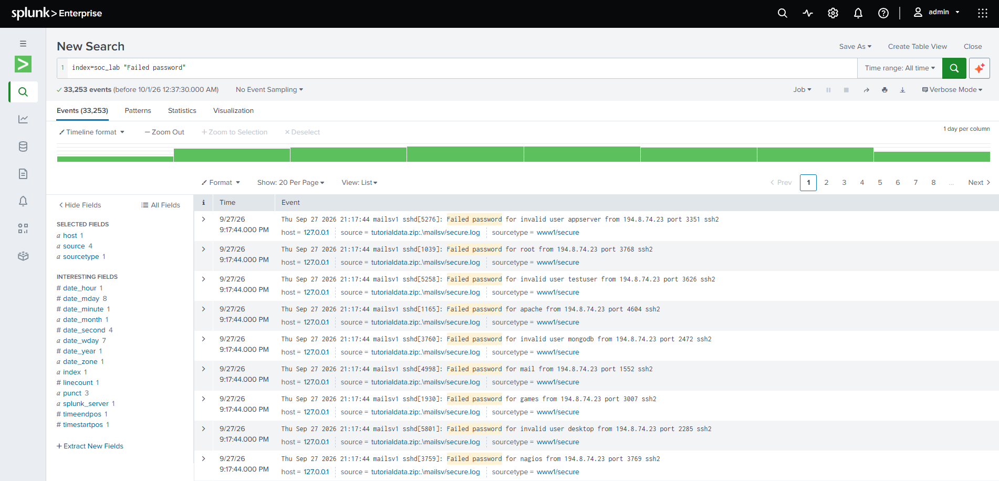
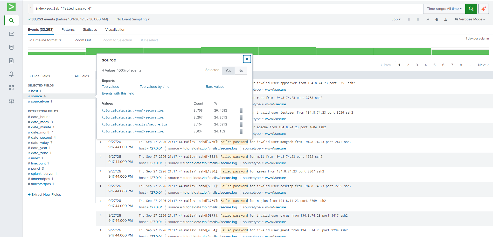
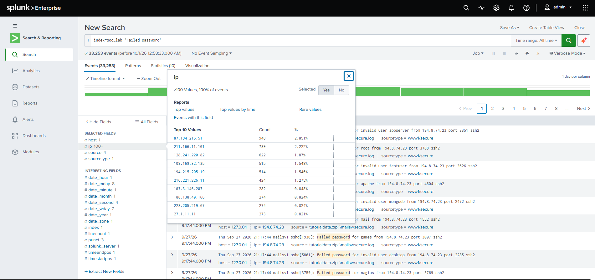
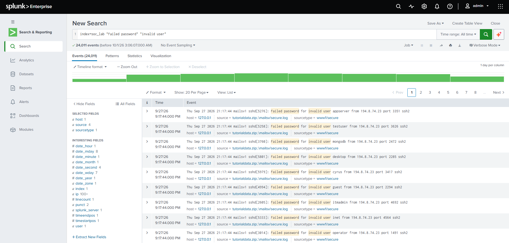
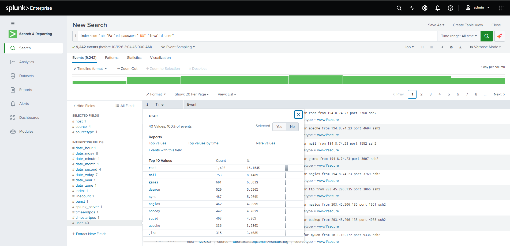
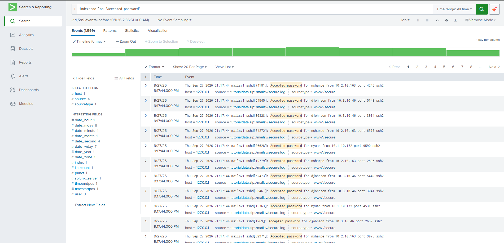
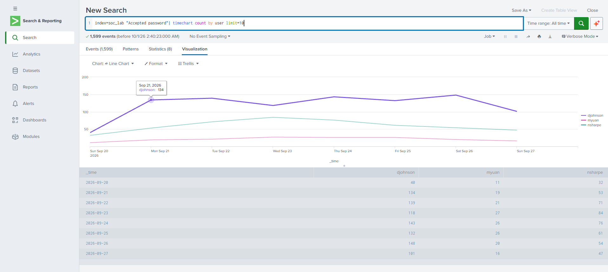
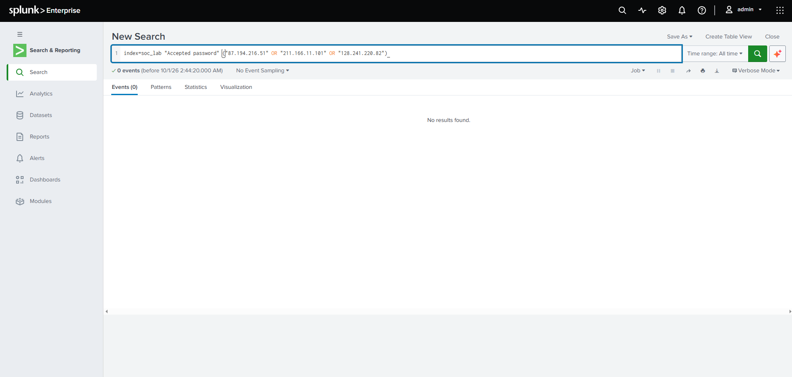
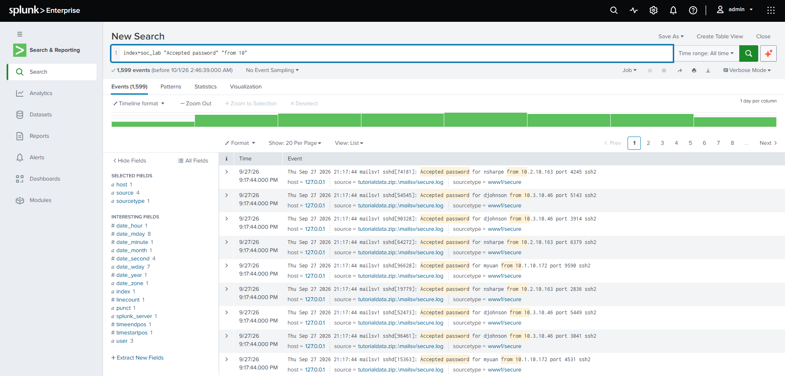
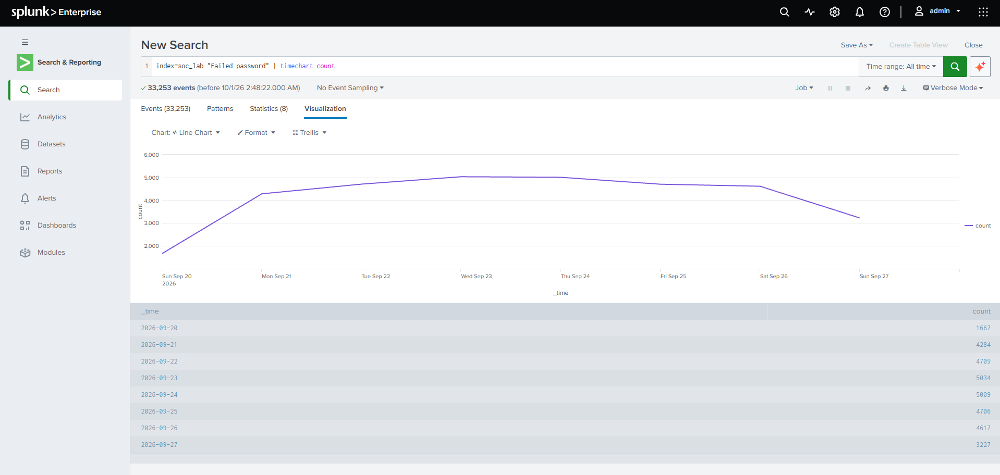

# SSH Brute Force Detection with Splunk

Analysis of SSH authentication logs in Splunk to identify a brute-force campaign and check whether any attacker gained access.

> **Note:** This is a training exercise using the Splunk Tutorial Data (`secure.log` files). It is not professional work experience.

## Objective
Find evidence of password-guessing attacks against SSH, identify the main source IPs and targeted accounts, and determine whether any attempt succeeded.

## Dataset
- Splunk Tutorial Data, `secure.log` (sshd) from four servers: www1, www2, www3, mailsv
- 8 days of events (Sep 20-27, 2026 as indexed)
- Index: `soc_lab`
- The `ip` and `user` fields were created with the Splunk Field Extractor

## Key Findings
- **33,253 failed SSH logins** over 8 days. On full days (Sep 21-26) the count stayed between 4,284 and 5,034, with the peak on Sep 23 (5,034). The first and last day are partial.
- The attack hit all four servers evenly: www1 8,798, www3 8,267, mailsv 8,154, www2 8,034.
- Attempts came from **more than 100 different source IPs**, so this was a distributed attack. Top sources: `87.194.216.51` (948), `211.166.11.101` (739), `128.241.220.82` (622). The top 10 IPs account for about 15% of all failures.
- **24,011 failures (72%) targeted non-existent accounts** ("invalid user"), for example `appserver`, `testuser`, `mongodb`, `desktop`, `cyrus`, `guest`, `itmadmin`, `inet`, `operator`. This is typical of automated dictionary attacks.
- The other **9,242 failures (28%)** targeted 40 different existing accounts. Most targeted: `root` (1,493), `mail` (753), `games` (601), `daemon` (520), `sync` (487).
- **1,599 successful logins**, all by three accounts: `djohnson` (955), `nsharpe` (478), `myuan` (166), with steady daily activity and no spikes.
- **No successful login came from the top 3 attacking IPs.** A search for successful logins that do not contain the text `from 10` returned 0 events, so every successful login came from an address starting with `10.` (internal range).

## Investigation Steps

### 1. Failed logins
Search: `index=soc_lab "Failed password"` returned 33,253 events.



The `source` field shows the events come from four servers:



### 2. Top attacking IPs
Using the extracted `ip` field and its Top 10 Values:



### 3. Targeted accounts
Non-existent accounts:

```
index=soc_lab "Failed password" "invalid user"
```

24,011 events:



Existing accounts:

```
index=soc_lab "Failed password" NOT "invalid user"
```

9,242 events, Top 10 Values of the `user` field:



### 4. Successful logins
Search: `index=soc_lab "Accepted password"` returned 1,599 events.



Logins per user per day:

```
index=soc_lab "Accepted password" | timechart count by user limit=10
```



### 5. Did any attacker get in?
Top 3 attacking IPs in successful logins:

```
index=soc_lab "Accepted password" ("87.194.216.51" OR "211.166.11.101" OR "128.241.220.82")
```

Result: 0 events.



Successful logins that do not contain `from 10`:

```
index=soc_lab "Accepted password" NOT "from 10"
```

Result: 0 events. The same search with `"from 10"` returns all 1,599 events, which confirms the filter works.




### 6. Timeline
```
index=soc_lab "Failed password" | timechart count
```



## Conclusion
The servers were under a sustained, distributed password-guessing attack. In the data analysed, no successful login came from the top 3 attacking IPs, and all successful logins came from addresses starting with `10.`.

**Limitations:** only the top 3 attacking IPs were checked individually, and `from 10` is a text match, not a strict check of the 10.0.0.0/8 network.

## Recommendations
- Disable SSH password login and use key-based authentication.
- Disable direct root login over SSH.
- Rate-limit or block repeated failures (e.g. fail2ban, firewall rules).
- Restrict SSH access to a VPN or an allow-list of addresses.
- Enable MFA where possible.
- Create a Splunk alert for many failed logins from one IP in a short period.

## MITRE ATT&CK
- T1110 Brute Force
- T1110.001 Password Guessing

## Tools
Splunk Enterprise (Free), SPL, Splunk Field Extractor
