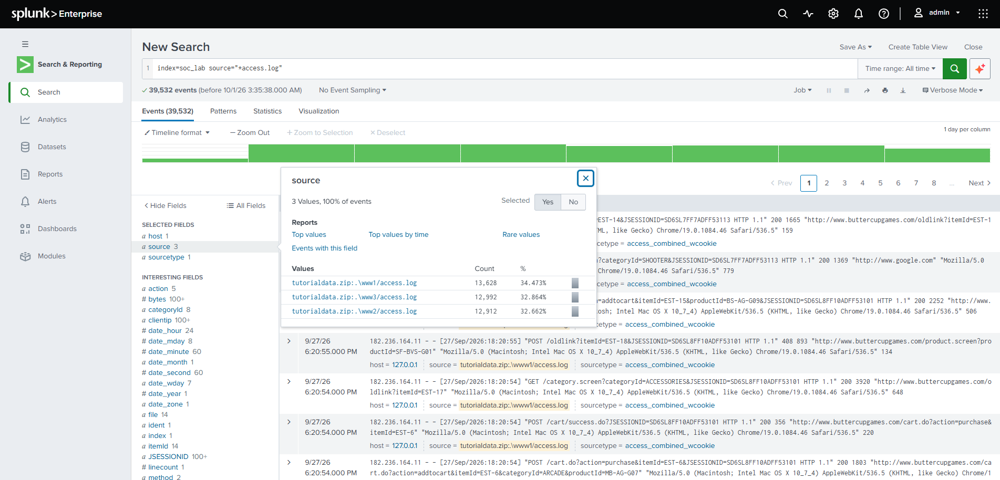
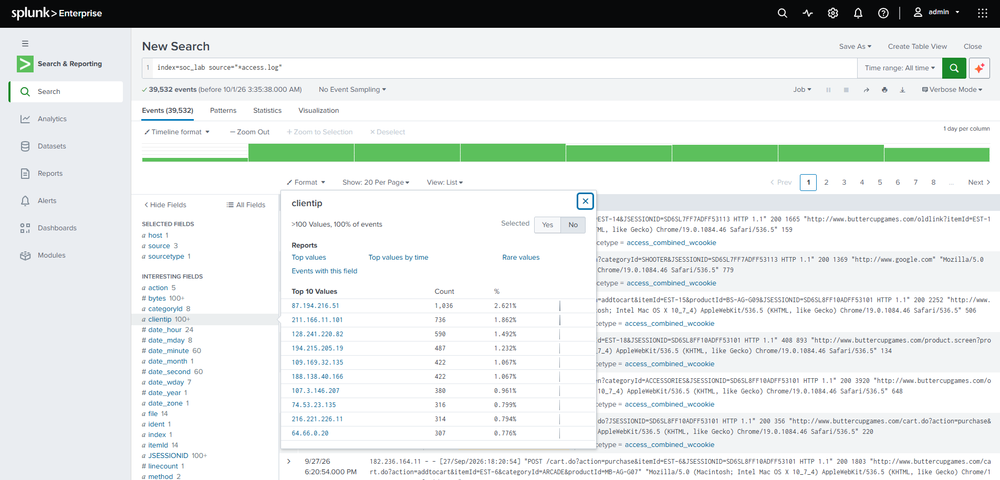
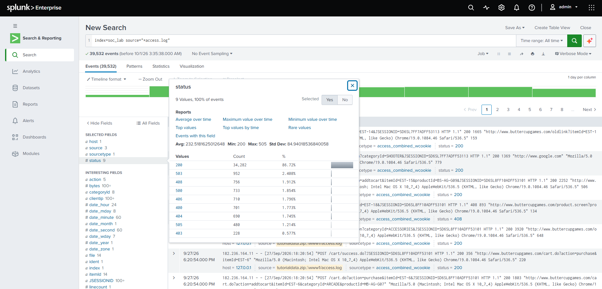
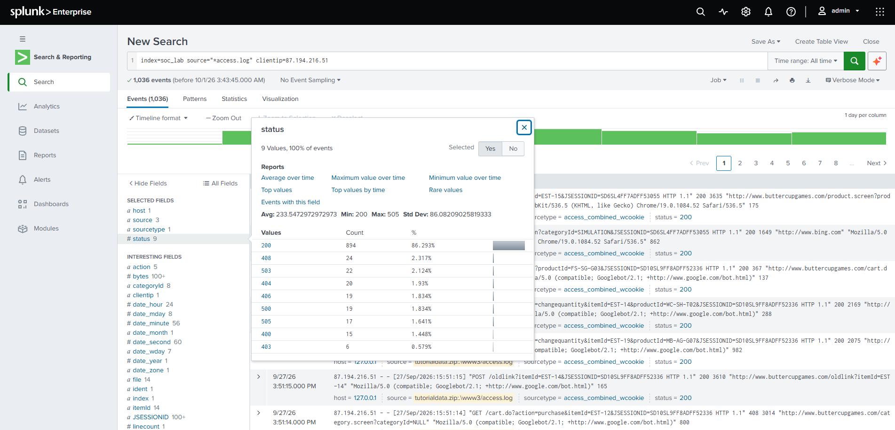
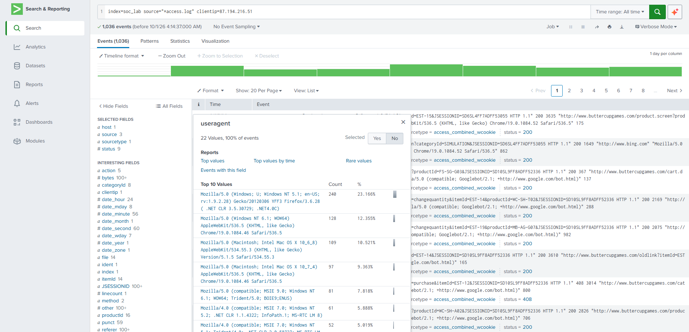
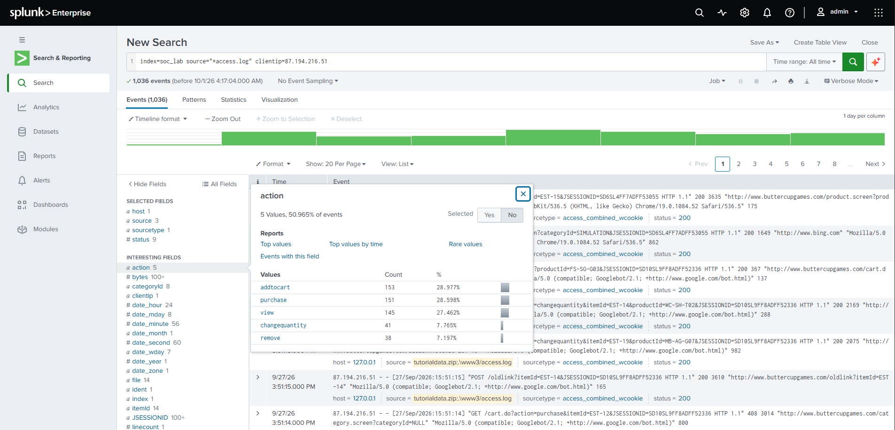
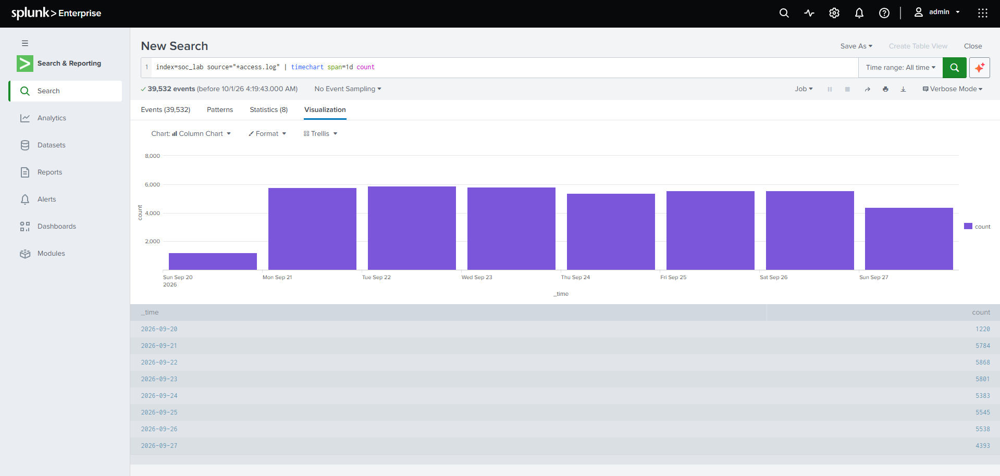

# Project 2: Web Server Log Analysis (Splunk)

## Objective

Analyze web server access logs from an online store to understand normal traffic, spot errors, and look for suspicious client behavior. This is a hands-on lab project built on the Splunk Tutorial Data (a training dataset), not a real production incident.

## Dataset

| Item | Value |
|---|---|
| Source | `access.log` (`access_combined_wcookie`) from the Splunk Tutorial Data |
| Application | Online store (buttercupgames.com) |
| Servers | www1, www2, www3 |
| Index | `soc_lab` |
| Events | 39,532 web requests |
| Period | 2026-09-20 to 2026-09-27 (All time) |

## Key Findings

- **Traffic is stable**: about 5,400-5,900 requests per day, with no spikes. Nothing here suggests a DoS attempt.
- **Load is evenly split** between servers: www1 13,628, www3 12,992, www2 12,912.
- **Most requests succeed**: HTTP 200 is 86.72% of traffic. There are 3,085 client errors (4xx) and 2,165 server errors (5xx). The most common error is **503** (952 events); 404 is only 690.
- **Top client `87.194.216.51`** made 1,036 requests. Its status codes look normal, but it presents **22 different user agents** (Firefox, Chrome, Safari, MSIE, iPad, Opera).
- That same client mixes real-browser user agents with a `Googlebot/2.1` string on some purchase and cart requests. A search crawler does not buy things, so this may be a **spoofed user agent**. This is a hypothesis; it would need reverse DNS verification, which is outside Splunk.
- **8 of the top 10 web clients** also appear among the top sources in the SSH brute-force project ([Project 1](../01-ssh-bruteforce-detection/README.md)). The Tutorial Data is synthetic, so this overlap is illustrative only.

## Investigation Steps

### 1. Overview of web requests

All web requests in the `access.log` source.

```
index=soc_lab source="*access.log"
```



### 2. Top clients

Top values of the `clientip` field. A few IPs generate far more requests than the rest.



### 3. HTTP status codes

Distribution of the `status` field: mostly 200, with 503 as the main error.



### 4. Status codes of the top client

Status distribution for `87.194.216.51` looks similar to the overall traffic (200 is 86.29% versus 86.72% overall), so the status codes alone do not reveal anything unusual.

```
index=soc_lab source="*access.log" clientip=87.194.216.51
```



### 5. User agents of the top client

The same query, field `useragent`: 22 different values for one IP (1,036 events). Real users normally keep one or two browsers.



### 6. Actions of the top client

Field `action`: addtocart 153, purchase 151, view 145, changequantity 41, remove 38. Purchases almost equal add-to-cart events, which is unusual shopping behavior.



### 7. Traffic over time

```
index=soc_lab source="*access.log" | timechart span=1d count
```

Daily traffic is flat. 2026-09-20 (1,220) and 2026-09-27 (4,393) are lower, most likely because they are partial days at the edges of the dataset.



## Conclusion

The web traffic looks healthy overall: stable volume, mostly successful requests, evenly balanced servers. The one item worth follow-up is client `87.194.216.51`: many user agents from one IP, a crawler string on purchase requests, and purchase counts close to add-to-cart counts. This could be a shared IP (office, proxy, NAT) or automated/abusive traffic.

### Limitations

- Training dataset: synthetic data, not real traffic.
- User agents can be faked and cannot prove identity on their own.
- No reverse DNS, threat intelligence or WAF data was available.

## Recommendations

1. Verify the IP with reverse DNS and threat intelligence.
2. Rate-limit or challenge clients that switch user agents often.
3. Alert on one client IP using many user agents in a short period.
4. Investigate the repeated 503 errors on the application side.
5. Correlate web clients with authentication logs (as with the SSH data in Project 1).

## MITRE ATT&CK (possible mapping)

- T1595 Active Scanning (if the traffic proves to be automated)
- T1036 Masquerading (if the Googlebot user agent is spoofed)

## Tools

Splunk Enterprise (Free license), SPL: `timechart`, field Top values, Statistics and Visualization tabs.
