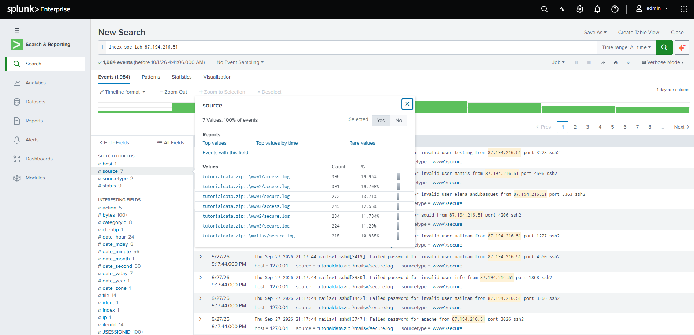
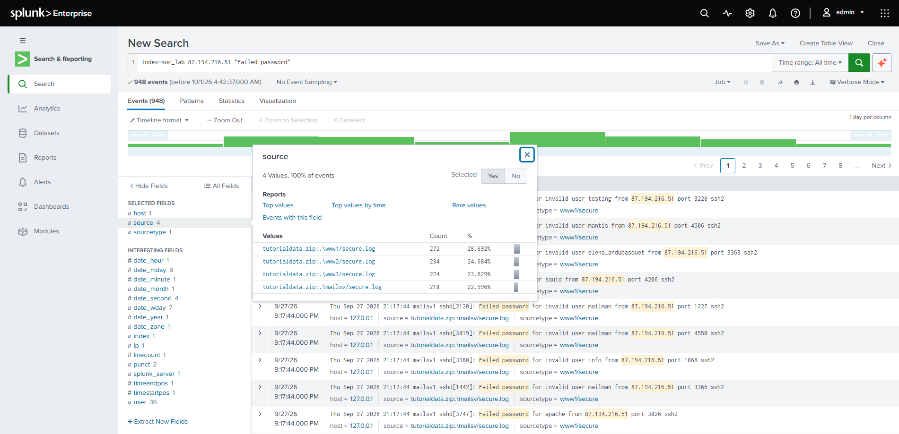
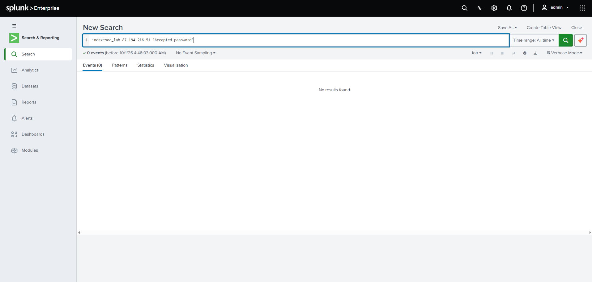
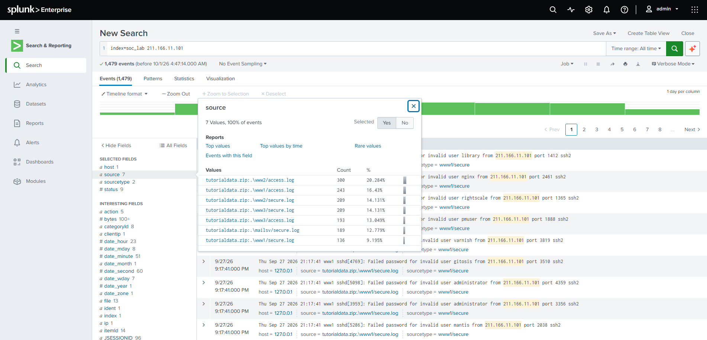
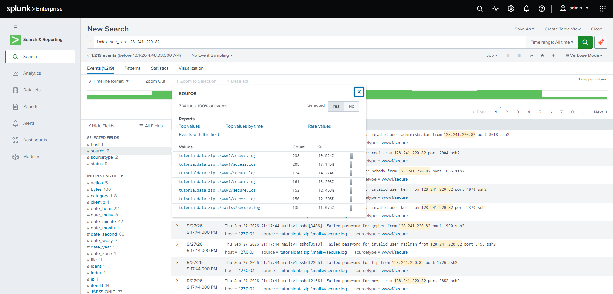
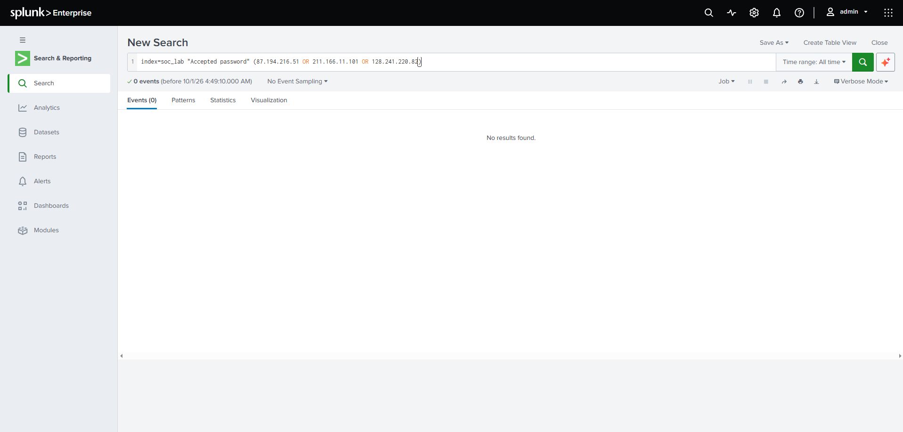

# Project 3: Threat Hunting, Tracking Suspicious IPs Across Logs (Splunk)

## Objective

Run a small hypothesis-driven threat hunt: do the IP addresses that guess passwords over SSH also show up in the web server logs? The goal is to follow one indicator (an IP address) across every log source instead of looking at each log in isolation. This is a lab project built on the Splunk Tutorial Data (a training dataset), not a real production incident.

## Hypothesis

IP addresses that were active in the web logs ([Project 2](../02-web-log-analysis/README.md)) are the same ones brute-forcing SSH ([Project 1](../01-ssh-bruteforce-detection/README.md)), so they are the same actors on both services.

## Dataset

| Item | Value |
|---|---|
| Sources | `access.log` (web) and `secure.log` (SSH) from the Splunk Tutorial Data |
| Servers | www1, www2, www3, mailsv |
| Index | `soc_lab` |
| Period | 2026-09-20 to 2026-09-27 (All time) |

## Key Findings

- All three of the busiest web clients also attack SSH. Each IP appears in the web logs of **all 3 web servers** and in the SSH logs of **all 4 servers**.
- The SSH events for these IPs are password guessing with typical service and default account names (for example `administrator`, `root`, `nobody`, `ftp`, `news`, `nginx`, `mailman`, `varnish`).
- For the first IP, **948 of 948** SSH events are `Failed password`.
- **No `Accepted password` events** were found for the first IP, or for all three IPs combined. There is no sign of a successful password login.
- The hypothesis is confirmed for this dataset.

| IP address | Web events | SSH events | Total events |
|---|---|---|---|
| 87.194.216.51 | 1,036 | 948 | 1,984 |
| 211.166.11.101 | 736 | 743 | 1,479 |
| 128.241.220.82 | 597 | 622 | 1,219 |

## Hunting Steps

### 1. Follow the first IP across all logs

I took the most active web client from Project 2 and searched for it in every log. Then I opened the `source` field to see which logs contain it.

```
index=soc_lab 87.194.216.51
```

The IP appears in all web logs (396 + 391 + 249 events) and in all SSH logs (272 + 234 + 224 + 218 events): 1,984 events in total.



### 2. Check what it does over SSH

```
index=soc_lab 87.194.216.51 "Failed password"
```

948 events, all failed logins, spread almost evenly across the 4 servers (www1 272, www2 234, www3 224, mailsv 218). An even spread points to automated guessing.



### 3. Check for a successful login

```
index=soc_lab 87.194.216.51 "Accepted password"
```

0 events. The password guessing did not succeed for this IP.



### 4. Repeat for the second IP

```
index=soc_lab 211.166.11.101
```

Same pattern: web 300 + 243 + 193 events, SSH 209 + 209 + 189 + 136 events (1,479 in total).



### 5. Repeat for the third IP

```
index=soc_lab 128.241.220.82
```

Same pattern again: web 238 + 209 + 150 events, SSH 174 + 161 + 152 + 135 events (1,219 in total).



### 6. Check all three for successful logins

```
index=soc_lab "Accepted password" (87.194.216.51 OR 211.166.11.101 OR 128.241.220.82)
```

0 events. None of the three IPs has an accepted password login.



## Conclusion

The same three IP addresses behave as ordinary store visitors on the web servers and, at the same time, guess passwords on every SSH server. No successful login was found for them. Checking one indicator across several log sources turns separate observations into one picture of the same suspected actors.

### Limitations

- Training dataset: synthetic data, not real traffic. The overlap of IPs shows the method, not a real attack.
- A text search counts every event that contains the IP anywhere (for the third IP this gives 597 web events, while the `clientip` field count in Project 2 was 590).
- Only `Accepted password` was checked. Other successful login types (for example key-based) were not searched.
- The same IP does not prove the same person or tool, for example with shared addresses or proxies.

## Recommendations

1. Block or rate-limit these IPs at the firewall, for both SSH and the web application.
2. Disable SSH password authentication and use keys (or add multi-factor authentication).
3. Add a SIEM rule that raises the priority when one IP appears in both the web logs and the authentication logs.
4. Keep a watchlist of known bad IPs and search every new log source against it.
5. Check other successful login types (such as `Accepted publickey`) for these IPs.

## MITRE ATT&CK

- T1110 Brute Force (T1110.001 Password Guessing)

## Tools

Splunk Enterprise (Free license), SPL, field Top values (`source` field).
